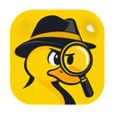
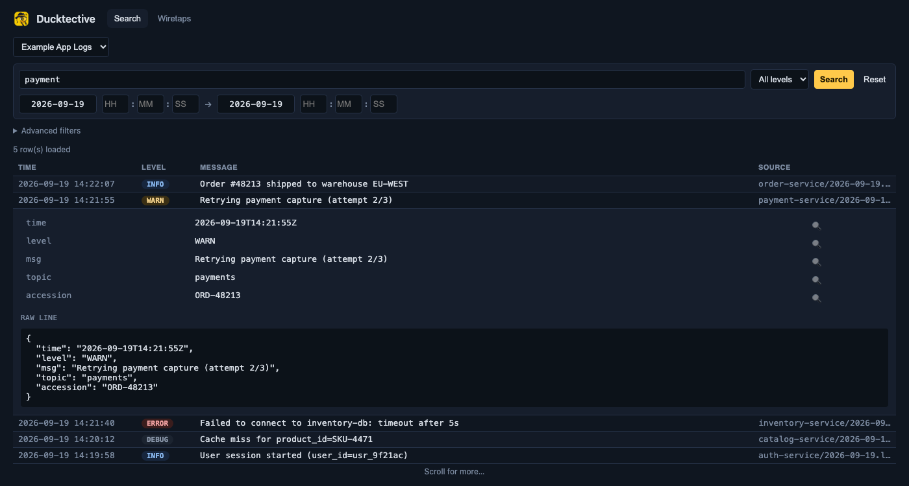
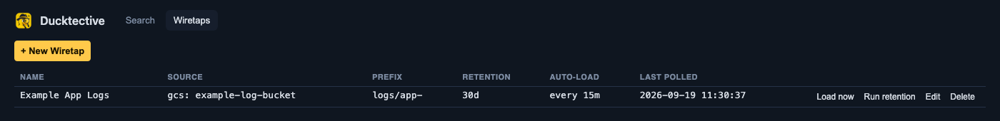
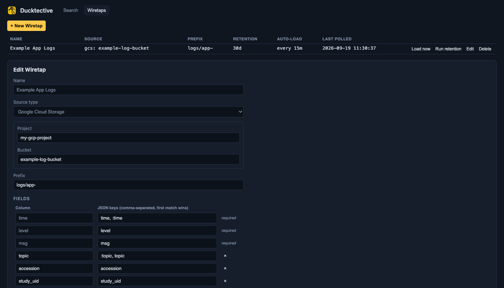
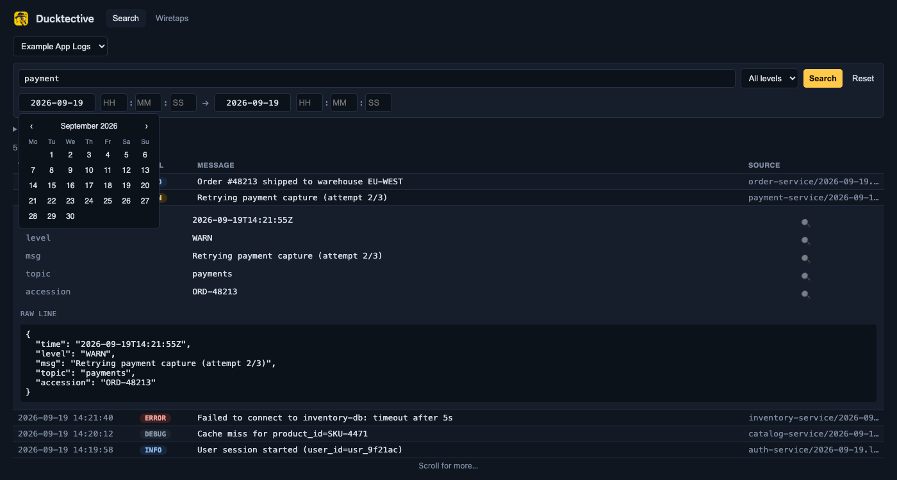

# Ducktective



A desktop app for searching structured (NDJSON) logs, without shipping
them to a hosted logging platform. Point it at a GCS bucket, tell it
which JSON fields matter, and it loads the lines into a local embedded
database you can filter and search like a real log viewer — no SQL, no
server, nothing leaves your machine except the original GCS reads.



## Why

Grepping through raw NDJSON files, or paying for a hosted log platform
just to search a handful of GCS buckets, are both overkill for a lot of
day-to-day debugging. Ducktective sits in between: it downloads the log
files you point it at, parses whichever JSON fields you care about into
real columns, and gives you a fast, filterable, point-and-click search
UI backed by [DuckDB](https://duckdb.org) running embedded inside the
app — one file per user, no external database to run.

## What this tool does

- Browses a GCS bucket/prefix and loads NDJSON log files into a local database.
- Lets you define **which JSON fields become columns** per source — not a fixed schema. `time`, `level`, and `msg` are required; everything else is up to you.
- Searches by free text, level, any configured field, and an ISO/24-hour date-time range — with infinite scroll, not page numbers.
- Keeps every log's original wall-clock timestamp exactly as written — never silently converts it to your local timezone.
- Auto-loads new files and applies retention cleanup on a schedule, per source, while the app is open.

It is not a replacement for a real observability stack (Elasticsearch,
OpenObserve, Datadog, ...) at production scale — it's for the case where
spinning one of those up is more overhead than the problem deserves.

## Core concept: Wiretaps

A **Wiretap** is one configured log source: a GCS project + bucket +
prefix, the fields to extract from each JSON line, and its own retention
and auto-load schedule. Each Wiretap gets its own table — add as many as
you need, one per bucket/log-stream you care about.



Creating or editing a Wiretap: pick a project and bucket (both
searchable — real accounts have dozens of each), a prefix, and the field
mapping. `Required` fields (`time`, `level`, `msg`) can point at multiple
candidate JSON keys — first one present wins, so one field survives
producers that spell the same concept differently (`"time"` vs.
`":time"`).



## Searching

Select a Wiretap, then filter by free text (matched against the whole
raw line, not just extracted fields), level, any configured field, and a
date/time range. Results load newest-first with infinite scroll; click a
row to expand its parsed fields and the original raw JSON line.

The date/time picker is a custom-built calendar + 24-hour numeric
spinner — deliberately not a native browser date input, since those
render using OS locale (US month/day order, AM/PM) with no way to force
ISO formatting.



## Prerequisites

- macOS or Windows
- [`gcloud` CLI](https://cloud.google.com/sdk/docs/install), authenticated via Application Default Credentials:
  ```bash
  gcloud auth application-default login
  ```
  Ducktective never asks for or stores credentials itself — it reads whatever ADC already resolves to, the same way `gcloud` does.
- Read access to the GCS bucket(s) you want to search.

## Installation

Download the latest build for your platform from the
[Releases](https://github.com/kvysotskyi/Ducktective/releases) page, or
build it yourself (see [Development](#development) below).

## Getting started

1. Launch the app. It checks for Application Default Credentials on startup; if none are found, it shows the exact `gcloud` command to run.
2. Open the **Wiretaps** tab and click **+ New Wiretap**.
3. Search for and pick a GCP project, then a bucket, then set a prefix (e.g. `logs/my-service-`).
4. Define your fields — `time`, `level`, `msg` are pre-filled with sensible defaults; add whatever else your logs carry.
5. Optionally enable auto-load and a retention period.
6. Save, then use **Browse & load files now** to pick specific files, or let auto-load pick up new ones on its own schedule.
7. Switch to **Search**, select the Wiretap, and start filtering.

## Development

### Requirements

- Go 1.23+
- Node.js (for the frontend's Vite build step)
- The [Wails CLI v2](https://wails.io/docs/gettingstarted/installation)
- A C toolchain for the DuckDB CGO build (Xcode command line tools on macOS; MinGW on Windows)

### Run in dev mode

```bash
wails dev
```

Hot-reloads the frontend against the real Go backend. `http://localhost:34115`
also works in a regular browser tab, with the bound Go methods available
on `window.go` from devtools.

### Build

```bash
wails build
```

DuckDB is embedded via `github.com/duckdb/duckdb-go/v2`, which ships
prebuilt static libraries per platform; no build tags are needed (its Arrow
bridge is opt-in via `-tags duckdb_arrow`, and this app only uses
`database/sql`).

### Testing

```bash
go build ./... && go vet ./... && go test ./...   # unit tests, no network
go test -tags integration ./internal/app/... -run TestIntegrationRealBucket -v   # hits a real GCS bucket via ADC
```

The integration tests target a bucket/prefix hardcoded in
`internal/app/integration_test.go` — point it at one you have access to
before running it.

## Where data is stored

One DuckDB file per user, at the OS's per-user config directory:
`~/Library/Application Support/ducktective` on macOS,
`%AppData%\ducktective` on Windows. One table per Wiretap.

## Project structure

```
Ducktective/
├── main.go                 # Wails entry point
├── internal/
│   ├── app/                # Wails-bound surface (*App methods), scheduler
│   ├── store/               # embedded DuckDB: Wiretap CRUD, ingest, search
│   ├── source/               # pluggable log-source interface (GCS today)
│   ├── gcp/, gcs/            # ADC auth, GCS client
│   ├── parse/                 # NDJSON line -> column values
│   └── appdir/                # per-OS data directory
├── frontend/
│   ├── index.html
│   └── src/
│       ├── main.js          # all UI behavior, plain JS, no framework
│       └── style.css
├── docs/                    # GitHub Pages site (see docs/index.md)
└── CLAUDE.md                # per-package notes for AI coding agents
```

Every backend package has its own `CLAUDE.md` with more detail —
start at the [top-level one](CLAUDE.md) if you're digging into the code.

## Documentation

Full usage guide: [docs/index.md](docs/index.md).
